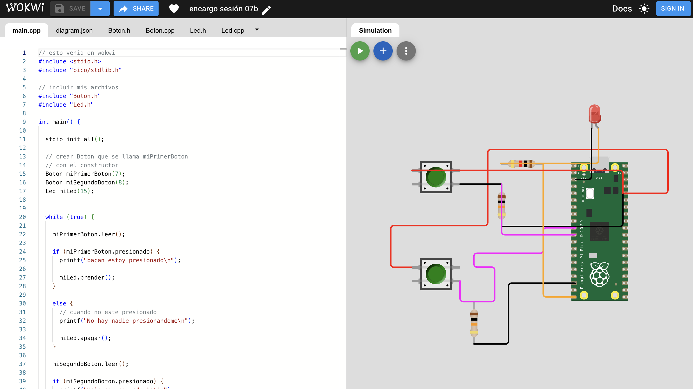

# sesion-07a

## apuntes sesión

## encargos

1. usar el ejemplo base visto en clases <https://wokwi.com/projects/476507507193136129>, agregar un segundo botón en la simulación de hardware, agregar una segunda instancia de la clase Boton, agregarle un atributo y un método a la clase Boton, y hacer que el segundo botón haga algo diferente al primero.
2. descargar todos los archivos de wokwi, descomprimir el archivo.zip y subir esa carpeta a tu repositorio en esta sesión.

Para esta tarea partí desde el ejemplo base visto en clases y fui agregando los elementos nuevos a partir de la misma lógica que ya existía.
Primero agregué un segundo botón en la simulación de Wokwi. Usé la imagen del pinout de la Raspberry Pi Pico para ubicar los GPIO disponibles y conectar correctamente cada componente. El primer botón quedó conectado al GPIO 7 y el segundo al GPIO 8. También agregué un LED conectado al GPIO 15.
En main.cpp trabajé copiando la misma lógica que ya tenía el ejemplo del primer botón. Creé una segunda instancia de la clase Boton:

 

https://wokwi.com/projects/477136488395400193

```cpp
Boton miPrimerBoton(7);
Boton miSegundoBoton(8);
```
Luego repetí la estructura de leer() y del if que revisa el atributo presionado, pero haciendo que el segundo botón tuviera una acción distinta al primero.
Después modifiqué la clase Boton. Agregué el atributo:
```cpp
int vecesPresionado;
```
y el método:
```cpp
void contarPresion();
```

La idea era que la clase no solo supiera si el botón estaba presionado, sino que también pudiera guardar información relacionada con las veces que se presionaba. Para implementar esta parte en Boton.cpp le pedí ayuda a ChatGPT, principalmente para entender cómo agregar el nuevo atributo y el nuevo método manteniendo la misma estructura de la clase que ya venía en el ejemplo.
Además agregué una clase nueva para el LED, separándola igual que la clase Boton en dos archivos: ```Led.h``` y ```Led.cpp```. La base de estos dos archivos también la hice con ayuda de ChatGPT, porque todavía no tenía claro cómo construir una clase nueva desde cero siguiendo la misma lógica del ejercicio.
En ```Led.h``` declaré la estructura general del LED: su patita, su estado y los métodos que podía realizar, por ejemplo prenderse y apagarse.
En ```Led.cpp``` quedó la implementación de esos métodos, cómo se inicializa el GPIO del LED como salida y cómo se envía un 1 o un 0 para prenderlo o apagarlo.

el LED lo agregué principalmente como apoyo visual. No era la parte central de la tarea, pero me ayudó a entender mejor si el botón estaba siendo detectado correctamente.


## lectura
