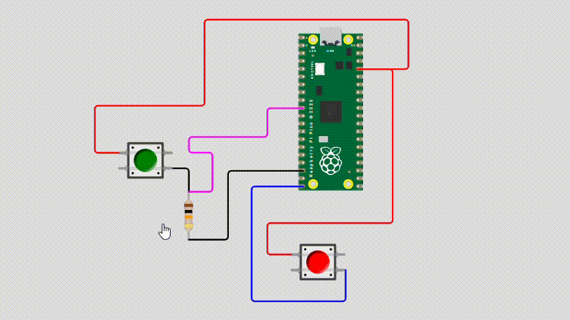
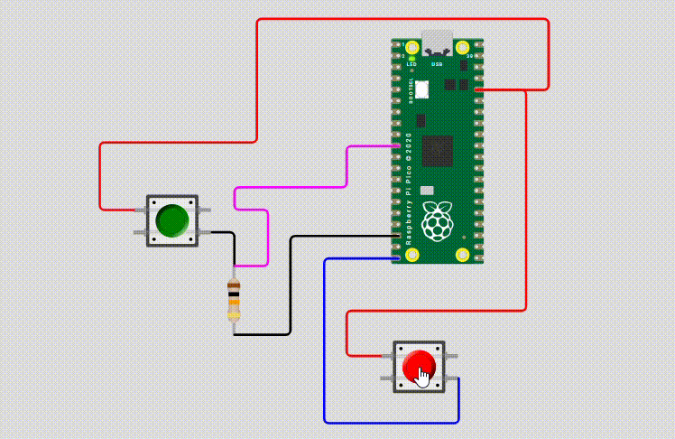

# sesion-07a

2026-09-29

## ejemplo aaron

El ejemplo utilizado en clase lo hizo Aaron el fin de semana, y podemos verlo aquí [ejemplo-07a](https://wokwi.com/projects/476140065507309569)

```
 //  en la línea 96 del ejemplo
 // encontramos esto
 // en donde % significa que aquí va un valor y que sea reemplazado con otra cosa
 // el .1 es la cantidad de decimales que va a mostrar
 // una vez imprima la temperatura
 // y la f es para que sea un float

 printf("termo de mati: %.1f grados\n", elDeMati.temperatura);
```

double = float de mayor resolución/capacidad

long = un int de mayor capacidad, caben más números enteros

## class Boton

```c
class Boton {

// atributos

bool presionado = 0;
bool noormalAbierto = true;
u int duracioPresionadoMS = 0;
int patita;
u int vecesPresionado = 0;
char[] nombre;

 // constructor

 // se hacen con parentesis
 // tambien con muercilagos
 // y con el nombre de la clase

 // opcion 1
 // Boton(int patita) {
 // patita = patita
 // }

 // opcion 2
 // la que mas vamos a usar
Boton(int nuevaPatita) {
patita = nuevaPatita;
}

 //  despues
 // cada boton tendra su nombre
 // y ademas su patita

 // Boton pausa(GP1);
 // Boton reproducir(GP3);
 // Boton apagar(GP30);

 // metodos

```

## apuntes

 - Podemos crear tanto class públicas como privadas, pero para lo que estamos haciendo todo es público: 

```cpp
  // debajo de la class
  // por ejmplo

class Termo {

  public:

  // atributos

  // constructor

  // metodo

}
```

 - %.1f en donde f = float, que son aproximaciones, no números enteros, por ejemplo:

```cpp
printf("termo de matias: %.1f grados\n", elDeMati.temperatura);
```

 - Existen los **double**, que son como los float, pero tienen mas capacidad/resolución.

 - Los "métodos" son funciones.

## encargos

1. usar el ejemplo base visto en clases <https://wokwi.com/projects/476507507193136129>, agregar un segundo botón en la simulación de hardware, agregar una segunda instancia de la clase Boton, agregarle un atributo y un método a la clase Boton, y hacer que el segundo botón haga algo diferente al primero.

Para el segundo botón quise que encendiera el LED integrado de la raspi, para esto, hubo que crear un botón nuevo dentro de los mismos archivos y luego darle un sentido, que en este caso es que encendiera y apagara el LED.

Y aquí tuve 2 versiones, la primera, en donde sólo enciende el LED:



Y para la segunda versión, como había que incluir un atributo y un método, lo que quise hacer es que el LED no se mantuviera encendido durante el tiempo que uno presionara el botón, sino que, al pulsarlo el LED se mantuviera prendido por cierta cantidad de tiempo, en el caso del ejemplo son 1500ms:


 
2. descargar todos los archivos de wokwi, descomprimir el archivo.zip y subir esa carpeta a tu repositorio en esta sesión.

Los archivos de wokwi y de mi conversación con claude se encuentran aquí:

[Wokwi - encargo-07a](https://github.com/disenoUDP/dis8645-2026-2-procesos-1/blob/main/06-hazzaily/sesion-07a/imagenes/encargo-07a.zip)

[Claude - encargo-07a](https://github.com/disenoUDP/dis8645-2026-2-procesos-1/blob/main/06-hazzaily/sesion-07a/imagenes/claude-boton-led.pdf)

## lectura

Durante la semana de receso decidí ser feliz ¿, así que no leí, por ende, esta semana vuelvoo.

Citas:

 1. "Recursion is used when it makes the solution clearer. There´s no performance benefit to using recursion; in fact loops are cometimes better forperformance." (pág. 40)

En esta cita nos dice que si bien nos enseña esta forma, no es que sea la más rápida, sino, que es la más fácil de aprender.

 2. "When you write a recursive function, you have to tell it when to stop recursing. That´s why **every recursive function has two parts: the base case, and the recursive case*". (pág. 41)

Y en esta, cómo funciona esta función, y que, como muchas otras, se mantiene en loop sin detenerse hasta que sucede un:

```cpp
end if
```

Actualmente voy en la página 41.

PD: Creo que definitivamente el libro ya no va a dejar de estar en inglés, y estoy pensando seriamente en cambiarlo porque me gusta pero me está costando descifrarlo y entenderlo.
