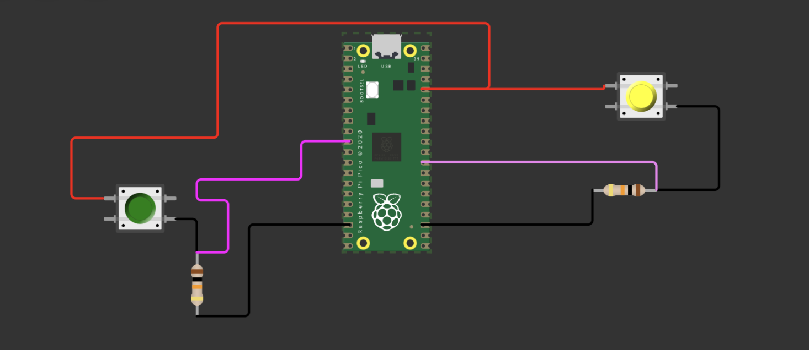

# sesion-07a

## apuntes sesión

En esta clase vimos código de Wokwi y llevamos a la práctica clases e instancias

para recordar: dejar todo como public (no vamos a usar private). Esto nos permite acceder directamente a los atributos y métodos de una clase desde afuera.

## clase e instancias 

+ clase: perro

+ instancia: copito

Si tengo una clase Perro, puedo crear variass clases de perros a partir de ella. Cada uno sería una instancia diferente, aunque todos tienen las características que definimos en la clase.

otro ejemplo: 
  
+ clase: chileno

+ instancia: RUT


## Constructores

El constructor sirve para preparar una instancia cuando la creamos. Es decir, permite definir desde el principio con qué valores va a partir ese objeto. Esto nos permite crear objetos de distintas maneras, dependiendo de los datos que tengamos o queramos entregar al momento de crearlos

+ tiene el mismo nombre de la clase y lleva paréntesis () y llaves {}
+ Por ejemplo, si tenemos una clase: Termo, podemos hacer que al crear un termo le indiquemos desde el principio cuántos mililitros tiene
+ se pueden tener varios constructores dentro de una misma clase, siempre que reciban parámetros diferentes

## Para recordar sobre el código: 

+ while (true): la condición siempre es verdadera, entonces el código que está dentro se repite constantemente
+ int main(): es la función principal de un programa. La ejecución comienza ahí. int indica que la función devuelve un número entero, main es el nombre de la función y dentro de {} escribimos las instrucciones que queremos ejecutar

## Boton 

Empezamos a crear clases para botones para poder agrupar en un solo lugar toda la información y acciones de un botón, en vez de tener que crear muchas variables cada vez que usamos uno. 

+  1. Atributos: primero tenemos que pensar qué cosas necesitamos guardar sobre un botón

```cpp
class Boton {
public:

    bool presionado = false;
    bool normalmenteAbierto = true;

    int duracionPresionado = 0;
    int patita;

    unsigned int vecesPresionado = 0;

    char nombre[20];

    void leer();
    void actualizar();
};
```

Los atributos serían:

+ bool presionado:  nos dice si el botón está presionado o no (puede ser true o false)
+ bool normalmenteAbierto:  indica cómo funciona el botón cuando no lo estamos presionando (si es true, significa que normalmente está abierto)
+ int duracionPresionado: guarda cuánto tiempo ha estado presionado
+ int patita: guarda el número del pin donde conectamos el botón
+ unsigned int vecesPresionado:  cuenta cuántas veces hemos presionado el botón 
+ char nombre[20]:  permite guardar el nombre del botón usando caracteres

  ### El constructor es un método
  
Sirve para darle los datos iniciales a nuestra instancia cuando la creamos y tiene que llamarse igual que la clase, por ejemplo: si nuestra clase se llama Boton, el constructor también se llama Boton. 

```cpp
Boton(int nuevaPatita) {
    patita = nuevaPatita;
}
```

- * al crear un botón tenemos que indicar en qué pin estará conectado
  
```cpp
Boton pausa(A0);
```

+ boton: clase
+ pausa:  instancia
+ A0:  dato que le entregamos al constructor 

*Así podemos crear varios botones usando la misma clase, pero cada uno puede estar conectado a un pin diferente*

Métodos: los métodos representan las cosas que nuestro botón puede hacer

```cpp
void leer();
void actualizar();
```

+ leer():  revisaría el estado del botón para saber si está presionado 
+ actualizar(): se encargaría de ir cambiando la información del botón según lo que vaya pasando

  *El void significa que el método no entrega ningún valor de vuelta. Simplemente realiza una acción*

  ## Cuando trabajamos con una clase podemos separarla en dos archivos,esto ayuda a ordenar el código

  + el archivo .h es como la presentación de la clase
  + aquí decimos qué atributos tiene y qué métodos existen, pero no necesariamente explicamos todavía cómo funcionan

    + cpp → donde hacemos que funcione: en el .cpp escribimos el funcionamiento de lo que declaramos en el .h
    + por ejemplo, si en el .h dijimos que existe leer(), en el .cpp escribimos las instrucciones que harán que leer() realmente lea el botón

### #Include
+ #include sirve para incorporar otro archivo o biblioteca a nuestro código
+ por ejemplo: #include "Boton.h"

esto permite que otro archivo pueda utilizar lo que definimos en Boton.h.


## encargos

1. usar el ejemplo base visto en clases <https://wokwi.com/projects/476507507193136129>, agregar un segundo botón en la simulación de hardware, agregar una segunda instancia de la clase Boton, agregarle un atributo y un método a la clase Boton, y hacer que el segundo botón haga algo diferente al primero.
2. descargar todos los archivos de wokwi, descomprimir el archivo.zip y subir esa carpeta a tu repositorio en esta sesión.


### DESARROLLO ENCARGO 

Para comenzar, partí agregando un segundo botón y una segunda resistencia a la simulación de Wokwi. Traté de mantener la misma conexión que tenía el primer botón, pero conectando el nuevo botón al pin GP22.

Después de hacer las conexiones, agregué una segunda instancia de la clase Boton en main.cpp:

```cpp
Boton miPrimerBoton(7);
Boton miSegundoBoton(22);
```

+ acá miPrimerBoton sigue conectado al pin 7, mientras que miSegundoBoton está conectado al pin 22

Luego copié la estructura que ya tenía para el primer botón y la adapté para el segundo. De esta forma, ambos botones utilizan el método leer() para saber si están siendo presionados, para que no hicieran exactamente lo mismo, hice que cada uno mostrara un mensaje diferente en el monitor serial.

+ el primer botón mantiene su mensaje original:

```cpp
if (miPrimerBoton.presionado) {
printf("bacan estoy presionado, pero igual me presiona\n"); } else {
printf("no hay nadie presionandome\n"); }
```

+ para el segundo botón hice algo diferente:

```cpp
if (miSegundoBoton.presionado) {
printf("hola, soy el segundo boton\n"); } else {
printf("el segundo boton esta libre\n"); }
```

Al principio no me funcionaba porque había que revisar bien las conexiones del segundo botón en Wokwi. Una vez que conecté correctamente el botón al GP22 y la resistencia a GND, pude hacer que ambos respondieran de manera independiente.

Después agregué un atributo en boton.h 


```cpp
char nombre[20];
```
( ahora cada botón puede tener un nombre )

+ en main.cpp le puse nombres:

```cpp
miPrimerBoton.nombre[0] = 'P';
miPrimerBoton.nombre[1] = '\0';

miSegundoBoton.nombre[0] = 'S';
miSegundoBoton.nombre[1] = '\0';
```
+ el método:

```cpp
  void mostrarNombre();
```
+ En Boton.h

```cpp
    void mostrarNombre();
```
+ en Boton.cpp:


```cpp
  void Boton::mostrarNombre() {
  printf("Soy el boton %s\n", Boton::nombre);
}
```

Finalmente en main.cpp:

```cpp
if (miSegundoBoton.presionado) {
    printf("hola, soy el segundo boton\n");
    miSegundoBoton.mostrarNombre();
}
```

agregué el atributo nombre, y el método mostrarNombre(, para que cada botón tenga un nombre y que el segundo botón, al ser presionado, mostrar un mensaje diferente al primero 



## lectura

En esta parte se habla de cómo el movimiento obrero terminó alejándose de los propios trabajadores

+ la representación de los trabajadores terminó reemplazando a los propios trabajadores

Algo que me costó entender fue que decía que la burocracia tenía el poder sobre el Estado y la economía, pero al mismo tiempo debía negar que existía como una clase dominante. También menciona que habla del fascismo como otra forma de defender el orden capitalista frente a las crisis y al miedo a una revolución. 

+ "la representación obrera se ha opuesto radicalmente a la clase"
+ "las cuestiones técnicas de organización resultaban ser cuestiones sociales"

